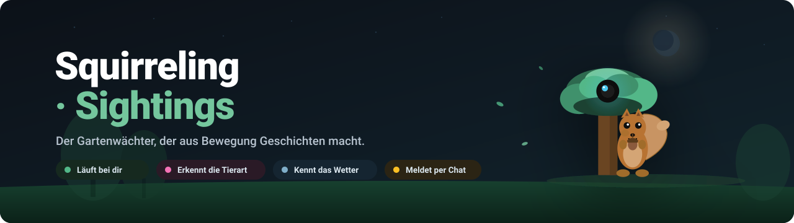
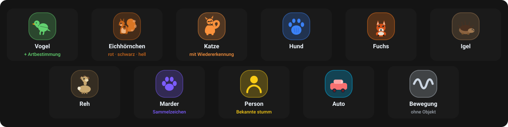
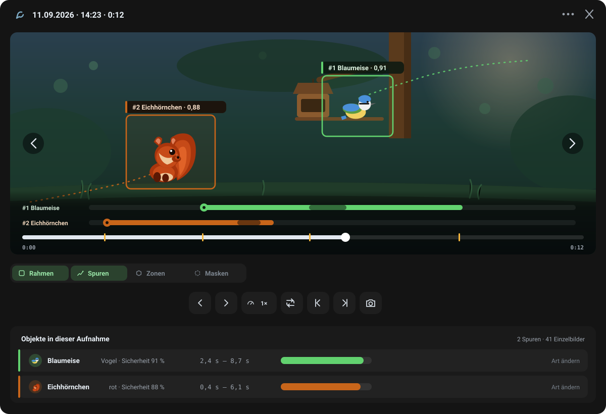
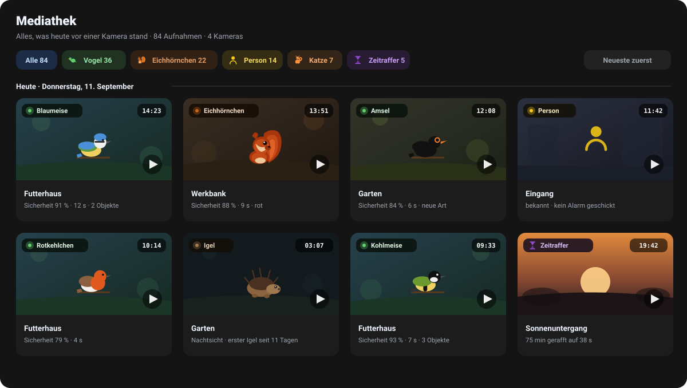
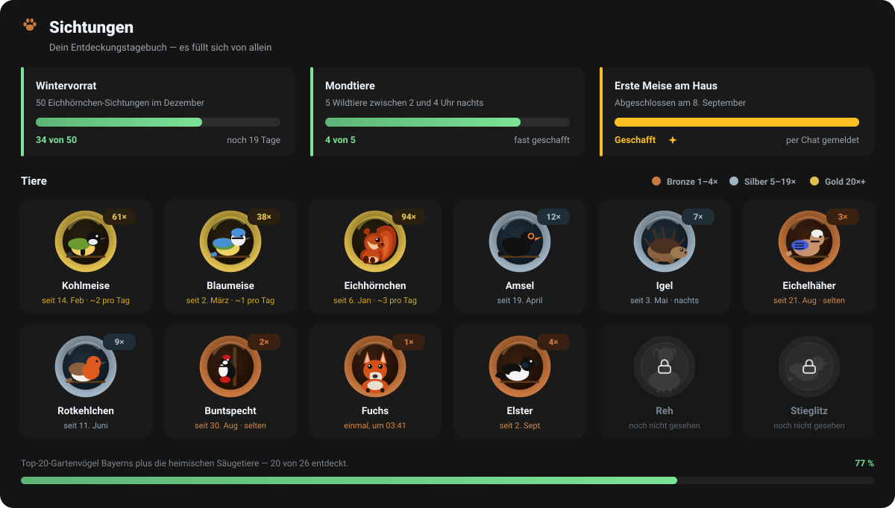
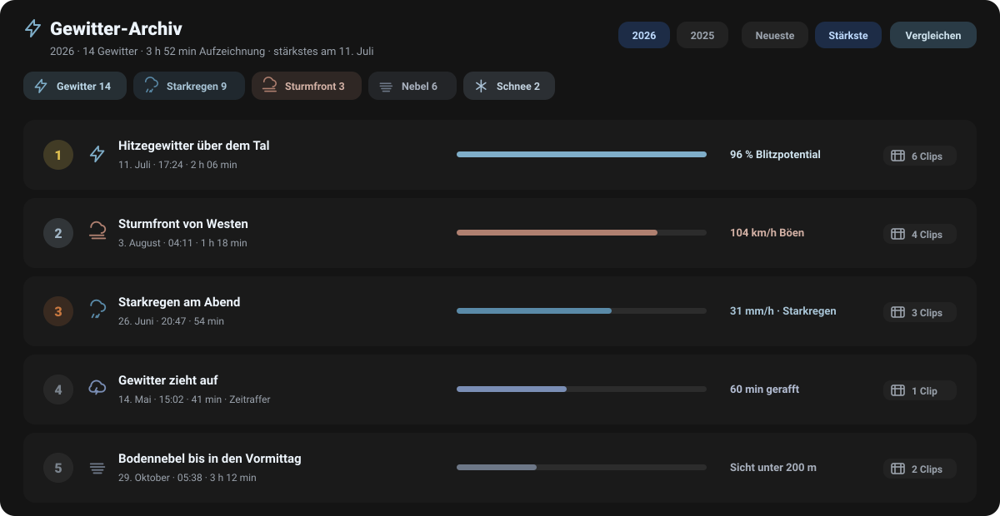
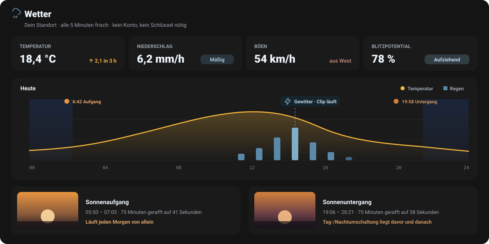
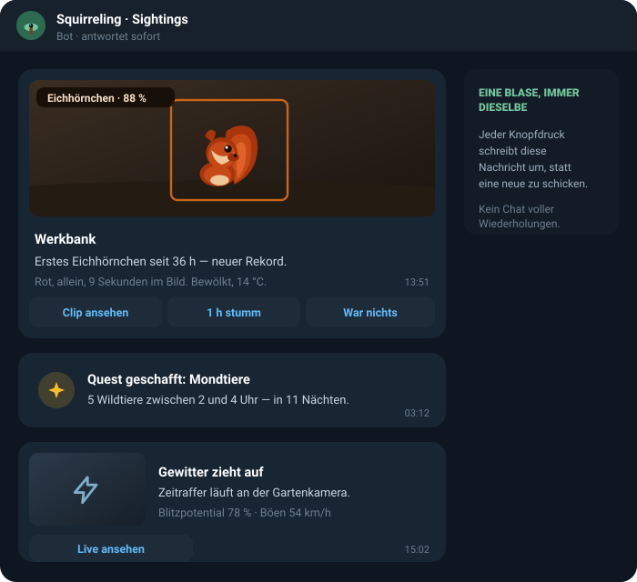
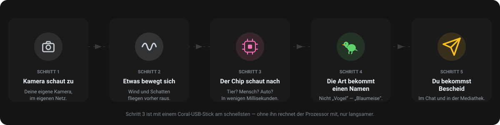

<p align="center">
  
</p>

<p align="center">
  
  
  
  
  
</p>

<p align="center">
  <a href="#was-ist-das">Was ist das</a> ·
  <a href="#was-die-kameras-erkennen">Was erkannt wird</a> ·
  <a href="#so-sieht-das-aus">So sieht das aus</a> ·
  <a href="#so-funktioniert-es">So funktioniert es</a> ·
  <a href="#loslegen">Loslegen</a> ·
  <a href="#für-technisch-interessierte">Technik</a>
</p>

<p align="center"><sub><em>English: this page is in German. A machine translation covers it well —
the project itself is a self-hosted garden-camera watcher that names the animal it sees.</em></sub></p>

---

## Was ist das?

Eine Kamera im Garten filmt jeden Tag tausende Sekunden Bewegung. Fast
alles davon ist nichts: Wind im Baum, ein Schatten, eine Fliege auf der
Linse. Man schaut zweimal rein und danach nie wieder.

**Squirreling · Sightings** sortiert das aus und behält die Augenblicke,
die eine Geschichte sind. Es sagt dir nicht „Bewegung erkannt“ — es sagt
dir, dass um 13:51 an der Werkbank das erste Eichhörnchen seit 36 Stunden
saß, und legt den Clip dazu.

Alles läuft auf deinem eigenen Rechner, in deinem eigenen Netz. Keine
Wolke, kein Abo, kein Konto. Nach außen geht nur, was du selbst
einschaltest — die Meldung in den Chat. Wetterdaten und
Artbeschreibungen werden **geholt**, nicht gesendet; deine Aufnahmen
bleiben, wo sie entstanden sind.

|  | |
|---|---|
| **Für dich, wenn** | du eine IP-Kamera im Garten hast, ein NAS oder einen kleinen Server, und wissen willst, welche Tiere vorbeikommen — ohne dafür Videomaterial durchzuscrollen. |
| **Eher nicht, wenn** | du eine fertige Alarmanlage suchst. Das hier ist ein Beobachtungstagebuch mit Meldefunktion, kein Wachdienst mit Zertifikat. |

---

## Was die Kameras erkennen

<p align="center">
  
</p>

Jede Klasse hat ihre eigene Farbe, und die bleibt überall dieselbe: im
Rahmen über dem Video, in der Filterpille der Mediathek, in der Spur der
Zeitleiste, auf der Medaille. Man muss die Zuordnung einmal sehen und nie
wieder nachschlagen.

Zwei Klassen können noch genauer werden:

- **Vögel** bekommen eine Art. Aus „Vogel“ wird „Blaumeise“, und beim
  ersten Mal legt das Programm von selbst ein kleines Dossier an —
  Bild, Kurztext, dazu bis zu drei Tonaufnahmen mit Beschriftung
  (Gesang / Ruf / Warnruf) und sichtbarer Nennung von Aufnehmendem und
  Lizenz.
- **Katzen und Personen** werden wiedererkannt. Wer auf der Whitelist
  steht, löst keine Meldung aus — der Postbote schon.

---

## So sieht das aus

> Die Bilder unten sind gezeichnete Ansichten, keine echten Aufnahmen.
> Sie zeigen Aufbau, Farben und Symbole der laufenden App, ohne den
> Garten und die Kameranamen des Betreibers zu veröffentlichen. Jedes
> Symbol darin stammt unverändert aus dem Quelltext der Oberfläche.

### Der Player — eine Aufnahme ansehen

<p align="center">
  
</p>

Die Zeitleiste liegt **im** Bild, nicht darunter, und hat pro erkanntem
Tier eine eigene Zeile: ein dicker Punkt beim ersten Auftauchen, ein
Balken so lange, wie es verfolgt wurde. Man sieht auf einen Blick, ob
zwei Tiere nacheinander oder gleichzeitig da waren — und springt mit
einem Tipp genau dorthin.

Rahmen und Spuren lassen sich einzeln abschalten. Erkennungs-Zonen und
Ausschluss-Masken sind beim Öffnen bewusst **aus**: das ist
Referenzgeometrie, die man ab und zu braucht und nicht jedes Mal.

### Die Mediathek — der Tag auf einer Seite

<p align="center">
  
</p>

Eine Kachel je Ereignis, mit Art, Sicherheit, Uhrzeit und Kamera. Oben
filtert eine Zeile nach Tierart — dieselben Symbole und Farben wie
überall sonst. Zeitraffer liegen im selben Raster wie die Sichtungen, es
gibt keine zweite Mediathek nebenan.

### Sichtungen — das Tagebuch, das sich selbst schreibt

<p align="center">
  
</p>

Jede Art, die schon einmal vor einer Kamera stand, bekommt eine
Medaille: Bronze ab der ersten Sichtung, Silber ab fünf, Gold ab zwanzig.
Was noch fehlt, steht grau daneben — man sieht, was im Garten noch
aussteht.

Darüber laufen **Quests**: „50 Eichhörnchen-Sichtungen im Dezember“, „5
Wildtiere zwischen 2 und 4 Uhr nachts“. Nichts davon muss man anstoßen;
sie laufen mit und melden sich, wenn sie voll sind.

### Gewitter-Archiv — Unwetter zum Nachschlagen

<p align="center">
  
</p>

Überschreiten Blitzpotential, Niederschlag oder Böen die Schwelle, legt
das Programm eine Episode an und schneidet mit. Später steht das Jahr als
Liste da, nach Stärke sortierbar, zwei Gewitter lassen sich
nebeneinanderlegen und vergleichen.

### Wetter — warum die Kamera gerade aufnimmt

<p align="center">
  
</p>

Das Wetter ist hier kein Beiwerk, sondern ein Auslöser. Sonnenauf- und
-untergang werden jeden Tag als 75-Minuten-Zeitraffer mitgeschnitten,
aufziehende Gewitter und durchziehende Fronten als 60-Minuten-Zeitraffer.

Regen wird nicht als „stark, ja oder nein“ gezeigt, sondern in den
Klassen des Deutschen Wetterdienstes — Trocken, Niesel, Leicht, Mäßig,
Stark, Starkregen. Dieselbe Einteilung in der Oberfläche, im Chat und
auf MQTT, damit nirgends zwei verschiedene Wahrheiten stehen.

### Die Meldung im Chat

<p align="center">
  
</p>

Pro Kamera gibt es **eine** Nachricht, und jeder Knopfdruck schreibt
genau die um. Kein Chat, der nach zwei Wochen aus tausend fast gleichen
Meldungen besteht — sondern eine Steuertafel, die immer an derselben
Stelle steht.

---

## So funktioniert es

<p align="center">
  
</p>

Einen Schritt zeigt das Bild nicht, weil er unsichtbar bleibt: bevor
aus einer Erkennung eine Sichtung wird, muss das Tier auf **mehr als
einem** Bild zu sehen sein. Das ist der Unterschied zwischen „ein Blatt
sah für ein Einzelbild aus wie eine Katze“ und einer Meldung, die
stimmt.

---

## Loslegen

**Du brauchst:** einen Linux-Rechner, ein NAS oder Unraid mit Docker ·
mindestens eine IP-Kamera mit RTSP im selben Netz · optional einen
Coral-USB-Stick für schnellere Erkennung · optional einen Telegram-Bot
für die Meldungen.

```bash
git clone https://github.com/premiumcola/Squirreling-Sightings.git
cd Squirreling-Sightings
docker compose up -d
```

Dann im Browser `http://<adresse-des-servers>:8099` öffnen. Beim ersten
Start führt ein Einrichtungs-Assistent durch die drei Dinge, die das
Programm von dir wissen muss:

1. **Wo du wohnst** — nur für Sonnenstand und Wetter, grob genügt.
2. **Deine erste Kamera** — das Netz wird durchsucht, meist steht sie
   schon in der Liste; sonst reichen Adresse, Benutzer und Passwort.
3. **Telegram** — optional. Ohne Token läuft alles weiter, nur eben ohne
   Meldungen aufs Handy.

Danach läuft es. Kameras verbinden sich von selbst, es gibt keinen
„Verbinden“-Knopf. Alle weiteren Einstellungen macht man in der
Oberfläche; die Dateien unter `storage/` muss niemand von Hand anfassen.

> **Mit Coral-Stick:** in `docker-compose.yml` steht der fertige
> Coral-Dienst auskommentiert bereit — er zieht ein vorgebautes Image
> statt selbst zu bauen. Nur einer der beiden Dienste darf gleichzeitig
> laufen. Einzelheiten:
> [`app/docs/INSTALL_CORAL.md`](app/docs/INSTALL_CORAL.md).
>
> **Auf Unraid:** [`app/INSTALL_UNRAID.md`](app/INSTALL_UNRAID.md).

### Wo die Daten liegen

Alles Persistente liegt in einem einzigen Ordner: `storage/`. Dort
stehen die Einstellungen, die Ereignisse, die Clips, die Zeitraffer und
der Wetterverlauf. Wer ein Backup einrichtet, richtet es auf diesen
Ordner ein — mehr ist es nicht.

---

## Was sonst noch drinsteckt

<table>
<tr>
<td width="56"></td>
<td><strong>Live zuschauen</strong><br/>
Eine Kachel je Kamera, HD einzeln zuschaltbar, Vollbild mit
Wischgesten auf dem iPhone. Nichts anzuklicken, keinen
„Verbinden“-Knopf.</td>
</tr>
<tr>
<td></td>
<td><strong>Dossiers mit Tonaufnahmen</strong><br/>
Zu jeder neu entdeckten Vogelart legt das Programm ein Blatt an: Bild,
Kurztext, bis zu drei Aufnahmen mit Beschriftung. Für die Töne braucht
es einen kostenlosen Xeno-canto-Schlüssel in <code>XENO_CANTO_API_KEY</code>;
ohne ihn bleibt das Blatt stumm, alles andere läuft weiter.</td>
</tr>
<tr>
<td></td>
<td><strong>„Erstes seit …“</strong><br/>
Taucht eine Art nach langer Pause wieder auf, sagt die Meldung genau
das — <em>Erstes Eichhörnchen seit 36 h, neuer Rekord.</em> Jede Klasse
hat ihre eigene Pause, ab der es sich lohnt: Vögel 4 h, Personen 6 h,
Füchse 24 h, Rehe 48 h.</td>
</tr>
<tr>
<td></td>
<td><strong>Zeitraffer, die sich selbst starten</strong><br/>
Einmal täglich der ganze Tag, dazu Sonnenauf- und -untergang und jedes
aufziehende Unwetter. Kaputte Einzelbilder — Decoder-Grau,
H.265-Bänder — werden vorher aussortiert, damit kein Zeitraffer
flackert.</td>
</tr>
<tr>
<td></td>
<td><strong>Betrieb ohne Rätselraten</strong><br/>
Jede Sichtung geht zusätzlich per MQTT an Home Assistant. Jede Logzeile
beginnt mit ihrem Bereich (<code>[cam:…]</code>, <code>[det]</code>,
<code>[tg]</code>, <code>[weather]</code>). Und wechselt eine Kamera die
IP, werden die alten Sichtungen beim nächsten Start umgehängt statt in
einem zweiten Ordner zu versanden.</td>
</tr>
</table>

---

## Für technisch Interessierte

Die ausführliche Fassung — Aufbau, Bildprüfung, Erkennungsstufen,
Ablage, Tests — steht in **[docs/technik.md](docs/technik.md)**.

In Kurzform: ein Flask-Prozess, ein Daemon-Thread je Kamera, eine SPA
aus ES-Modulen ohne Build-Schritt, alles Persistente als JSON und MP4
unter `storage/`. Erkennung in drei Stufen — Coral EdgeTPU (4–40 ms),
sonst tflite auf dem Prozessor (~300 ms), sonst nur Bewegung. Welche
Stufe läuft, steht in der Oberfläche und im Log; ein stiller Rückfall
auf den Prozessor ist ausgeschlossen.

| Wohin | Was steht dort |
|---|---|
| [`docs/technik.md`](docs/technik.md) | Architektur, Bildprüfung, Erkennung, Tests |
| [`app/README.md`](app/README.md) | Modulkarte des Backends |
| [`app/INSTALL_UNRAID.md`](app/INSTALL_UNRAID.md) | Unraid-Installation |
| [`app/docs/INSTALL_CORAL.md`](app/docs/INSTALL_CORAL.md) | Coral-Stick einrichten |
| [`app/docs/camera_notes.md`](app/docs/camera_notes.md) | RTSP-Pfade je Hersteller, ID-Schema |
| [`CLAUDE.md`](CLAUDE.md) | Arbeitsregeln des Repos |

---

## Mitmachen

Pull Requests sind willkommen. Fehlermeldungen bitte mit Log
(`docker logs squirreling-sightings --tail 200` oder der Logs-Reiter in
der Oberfläche), dem genauen Kameramodell samt Firmware und den
Schritten zum Nachstellen.

Bitte niemals echte Adressen, Zugangsdaten oder Chat-IDs in Issues oder
Screenshots — in diesem Repo gelten überall Platzhalter (`192.0.2.x`,
`cam.lan`, `<BOT_TOKEN>`).

## Lizenz

Noch keine hinterlegt. Bis dahin gilt: alle Rechte vorbehalten. MIT ist
geplant — sobald eine `LICENSE` im Wurzelverzeichnis liegt, gilt die und
nicht dieser Absatz.

## Dank

**Coral / Google** für den EdgeTPU-Stick · **python-telegram-bot** ·
**Open-Meteo** für eine Wetter-Schnittstelle ohne Schlüssel und ohne
Rechnung · **iNaturalist** für das Vogelmodell · **Xeno-canto** für die
Tonaufnahmen (Aufnehmende werden im Dossier genannt) ·
**Wikipedia** für die Artbeschreibungen · **DWD** für die
Niederschlagsklassen · **astral** für den Sonnenstand.

Die Zeichnungen in dieser README sind hauseigen. Woher jeder Glyph
stammt und was beim Ändern zu beachten ist, steht in
[docs/assets/CREDITS.md](docs/assets/CREDITS.md).
