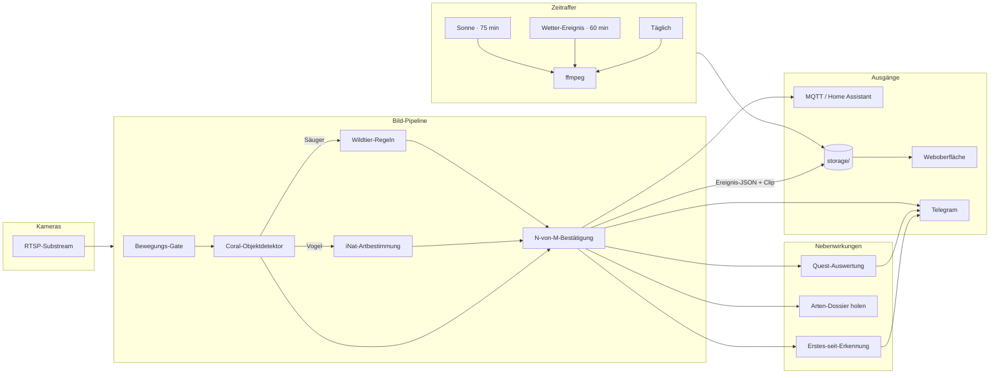

# Technik

Die Einzelheiten, die auf der Startseite den Blick verstellt haben.
Wer nur wissen will, was das Projekt tut, liest
[die README](../README.md) und ist danach fertig.

- [Was wo läuft](#was-wo-läuft)
- [Der Weg eines Bildes](#der-weg-eines-bildes)
- [Die Bildprüfung](#die-bildprüfung)
- [Erkennung: die drei Stufen](#erkennung-die-drei-stufen)
- [Ablage auf der Platte](#ablage-auf-der-platte)
- [Tests und Lint](#tests-und-lint)
- [Stack](#stack)
- [Weiterlesen](#weiterlesen)

---

## Was wo läuft

Ein Python-Prozess, ein Flask-Server, pro Kamera ein Daemon-Thread.
Kein Broker dazwischen, keine zweite Datenbank, kein Message-Bus —
alles, was persistent ist, liegt als JSON oder MP4 unter `storage/`.

| Schicht | Wo | Was |
|---|---|---|
| Bilder holen | `camera_runtime/` | RTSP-Substream je Kamera, Bewegungs-Gate, Aufnahme, Zonen, Zeitraffer |
| Erkennen | `detectors/` | Coral-Objektdetektor → Vogelarten → Wildtier-Regeln |
| Bestätigen | `detection_confirmer.py` | N-von-M-Fenster gegen Einzelbild-Fehlalarme — voreingestellt 3 Treffer in 5 s, je Klasse einstellbar |
| Nachverfolgen | `tracking_worker.py` | Spuren-Sidecar `tracks.json` für die Rahmen im Player |
| Melden | `telegram_bot/`, `mqtt_service.py` | Chat-Blase mit Edit-in-Place, MQTT für Home Assistant |
| Wetter | `weather_service/` | Open-Meteo-Abfrage, Verlauf, Episoden, Sonnen- und Ereignis-Zeitraffer |
| Ablegen | `storage.py`, `settings_store.py` | Ereignis-JSONs je Kamera, `settings.json` als Quelle der Wahrheit |
| Ausliefern | `routes/` | Blueprints; die Oberfläche spricht ausschließlich `/api/*` |

Aufschlüsselung Modul für Modul: [`app/README.md`](../app/README.md).

---

## Der Weg eines Bildes



Die Oberfläche ist eine SPA aus ES-Modulen ohne Build-Schritt für
JavaScript; nur das CSS wird von `css_builder.py` aus den Teildateien
unter `app/web/static/css/` zusammengesetzt. Externe Laufzeit-Abhängig­keiten
gibt es außer Open-Meteo keine.

---

## Die Bildprüfung

<p align="center">
  
</p>

Jedes einzelne Zeitraffer-Bild läuft durch dieselbe Prüfkette. Das
Profil wird vor jedem Bild frisch gewählt und alle zwei Minuten
nachjustiert — so läuft auch ein 75-Minuten-Sonnen-Zeitraffer, der
mitten durch die Dämmerung bricht, nie mit den falschen Schwellen.
Kaputte Decoder-Bilder werden vor der Profilwahl aussortiert, damit sie
das Profil nicht vergiften.

**Drei Profile**, je eigene Schwellen für `tile_dead_fraction`,
`flat_gray_std_floor` und `grey_midband_total_std`:

| Profil | Bedingung | Strenge |
|---|---|---|
| `DAY` | Medianhelligkeit ≥ 110 | streng — 35 % tote Kacheln |
| `TWILIGHT` | 50 ≤ Median < 110 | ausgewogen — 55 % |
| `NIGHT` | Median < 50 | locker — 85 %; echte IR-Nachtszenen haben legitim flache dunkle Flächen |

**Prüferstapel**, in dieser Reihenfolge, der erste Treffer gewinnt:
Helligkeitsgrenzen → `pink_artifact` / `patterned_magenta` →
`flat_gray_full_frame` → `horizontal_anomaly_band` (H.265-Bandkorruption)
→ `no_detail` → `grey_uniform` → `dead_area` (8×5-Kachelraster) →
`local_macroblock_anomaly` → `bright_outlier_dark_scene` (nur NIGHT /
TWILIGHT) → `split_left/right_dead` → `grey_midband`
(Macroblock-Schmier) → `colorbar`. Die Reihenfolge ist kein Zufall:
`flat_gray_full_frame` läuft vor `dead_area`, weil sonst ein komplett
graues Bild unter dem unschärferen Grund abgelegt würde, und
`horizontal_anomaly_band` vor den Szenen-Gattern, damit ein korruptes
Bild in einer texturarmen Nacht nicht als „letztes gutes" Bild
weiterverwendet wird. Pro Zeitfenster bis zu sechs Versuche im Abstand
von 0,4 s.

Ablehnungsgründe tragen ihre Parameter im Namen
(`horizontal_anomaly_band(y=50%,h=6%,score=2.6)`) und landen unter
`_rejected/<grund>/`. Beim Nachsehen ist damit sofort klar, auf welcher
Bildhöhe das Problem saß und welcher Teilprüfer angeschlagen hat.

Mehr dazu: [`frame-quality.md`](frame-quality.md).

---

## Erkennung: die drei Stufen

| Stufe | Was | Ungefähr |
|---|---|---|
| 1 | Coral EdgeTPU über echtes pycoral | 4–40 ms je Modell |
| 2 | tflite auf dem Prozessor | ~300 ms |
| 3 | nur Bewegung, keine Klasse | — |

Welche Stufe gerade läuft, steht als Pille in der Oberfläche und als
Zeile im Log (`[det] Coral TPU aktiv …`). Greift die TPU nicht, steht
der Grund als WARNING davor — ein stiller Rückfall auf den Prozessor
wäre genau die Art Fehler, die monatelang unbemerkt bleibt.

Das produktive Image ist `ghcr.io/premiumcola/squirreling-sightings:coral`
(Python 3.9 · tflite-runtime 2.5.0.post1 · echtes pycoral). Warum das
Python-3.11-Standard-Image die TPU **nicht** benutzen kann, steht
ausführlich in [`coral-tpu-image.md`](coral-tpu-image.md) — kurz: für
cp311 gibt es kein pycoral-Wheel, und der Delegate-Weg ohne pycoral
scheitert an einer ABI-Drift zwischen libedgetpu 16.0 und
tflite-runtime 2.14.

Der Coral-Stick meldet sich kalt als `1a6e:089a` und nach dem ersten
Firmware-Upload als `18d1:9302`. Beide IDs sind dasselbe Gerät.

---

## Ablage auf der Platte

```
storage/
  settings.json                 # Quelle der Wahrheit für alle Einstellungen
  settings.json.bak / .bak2     # zwei Generationen Rotation
  settings.json.bak.<ts>        # Sicherung vor jeder Migration
  weather_history.json          # gleitender Open-Meteo-Verlauf
  motion_detection/<cam_id>/<datum>/<event_id>.{jpg,json,mp4}
  timelapse/<cam_id>/<datum>.mp4
  timelapse_frames/<cam_id>/<profil>/<datum>/<HHMMSS>.jpg
  weather/<cam_id>/             # Wetter-Clips
  logs/                         # *.log, nicht im Git
  cat_registry.json             # nicht im Git
  person_registry.json          # nicht im Git
```

`settings.json` wird **nie** im Ganzen überschrieben, nur additiv
gemischt. Kamera-Ordner heißen deterministisch
`hersteller_modell_name_letztesoktett`; wechselt eine Kamera die IP,
bindet die Migration den Altbestand beim nächsten Start idempotent um,
statt einen zweiten Ordner anzulegen.

Die Datenfallen, die dieses Projekt schon einmal Sichtungen gekostet
haben, stehen in [`architecture-locks.md`](architecture-locks.md).

---

## Tests und Lint

```bash
cd app
python -m pytest tests/ -q                 # 4 870 Tests in 246 Dateien
python -m pytest tests/test_camera_id.py -v # eine Datei
```

Die Tests laufen ohne Hardware: kein Coral, keine Kamera, keine echten
APIs. Fixtures benutzen Dokumentations-IPs nach RFC 5737 (`192.0.2.x`).
Synthetische Prüfbilder entstehen im Test selbst; die echten
Korruptionsbilder aus dem Betrieb liegen unter
`app/tests/fixtures/frame_validation/` und sind die Messlatte für jede
Änderung an den Prüfern.

Die Oberfläche hat eigene Tests — 94 Dateien unter
`app/web/static/js/**/_tests/`, gefahren mit `node --test`, ohne
DOM-Bibliothek.

Die CI (`.github/workflows/lint.yml`) prüft bei jedem Push:

```bash
ruff check app/ --select F,E9,B904,B905,F401   # blockierend
ruff format --check app/
mypy app/app/
npx eslint app/web/static/js                   # Fehler blockierend
cd app && python -m pytest tests/               # blockierend
```

---

## Stack

Python 3.9 (Coral-Image) bzw. 3.11 · Flask · APScheduler ·
python-telegram-bot · paho-mqtt · OpenCV · numpy · Pillow ·
PyCoral / TensorFlow Lite · iNaturalist-Vogelmodell · astral ·
Open-Meteo · RTSP + ONVIF-Discovery.

Kennzahlen: 337 Python-Dateien unter `app/app/`, 368 JavaScript-Module,
60 CSS-Teildateien, die `css_builder.py` zu einer `app.css`
zusammensetzt.

---

## Weiterlesen

| Datei | Inhalt |
|---|---|
| [`app/README.md`](../app/README.md) | Modulkarte des Backends, Paket für Paket |
| [`app/INSTALL_UNRAID.md`](../app/INSTALL_UNRAID.md) | Unraid-Installation inkl. Bind-Mounts |
| [`app/docs/INSTALL_CORAL.md`](../app/docs/INSTALL_CORAL.md) | Coral-Stick einrichten, EdgeTPU-Modelle laden |
| [`app/docs/camera_notes.md`](../app/docs/camera_notes.md) | RTSP-Pfade je Hersteller, ID-Schema, Discovery-Eigenheiten |
| [`coral-tpu-image.md`](coral-tpu-image.md) | Warum nur das `:coral`-Image rechnet |
| [`frame-quality.md`](frame-quality.md) | Bildprüfung im Detail |
| [`architecture-locks.md`](architecture-locks.md) | Entscheidungen, die nicht mehr aufgemacht werden |
| [`CONTROL_FLOW.md`](CONTROL_FLOW.md) | Kontrollfluss vom Boot bis zum Ereignis |
| [`ui-screenshots.md`](ui-screenshots.md) | Die Oberfläche wirklich ansehen statt CSS lesen |
| [`../CLAUDE.md`](../CLAUDE.md) | Arbeitsregeln des Repos |

In der Dokumentation stehen ausschließlich Platzhalter-Adressen —
`192.0.2.x`, `198.51.100.x`, `203.0.113.x`, `2001:db8::*`, `cam.lan`,
`<BOT_TOKEN>`, `<CHAT_ID>`. Nie eine echte LAN-Adresse, nie ein echtes
Token.
